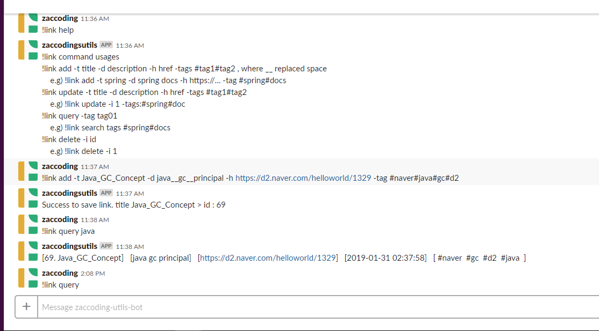

## My utils bot :)  

> ## Features  

- **management links**  
```aidl
!link command usages
!link add -t title -d description -h href -tag #tag1#tag2 , where "__" replaced "
    e.g) !link add -t spring -d spring docs -h http:/your -tag #spring#docs
!link update -t title -d description -h href -tag #tag1#tag2
    e.g) !link update -i 1 -tags:#spring#doc
!link query -tag tag01   , find all if no args
    e.g) !link query tags #spring#docs    
!link delete -i id
    e.g) !link delete -i 1
!link backup [pretty]  , where pretty is optional  
    e.g) !link backup pretty
```  

> example  

  

> ## Getting started  

```aidl
$ git clone  
$ ./gradlew clean build -x test tarz
$ tar -xvf build/tar/helper-bot.sh
// add ur slack bot token to override
$ vi application.yaml 
$ build/tar/helper-bot/scripts/start.sh
```  


